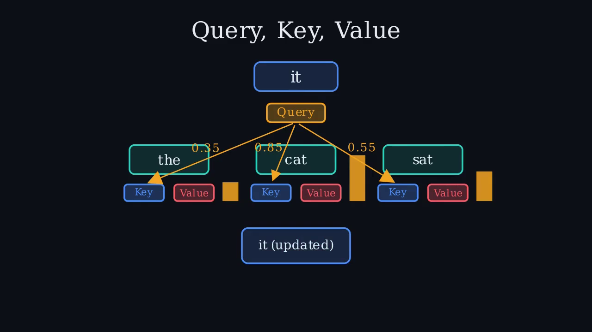

# PaperMotion

Turn research papers into **genuinely explanatory animated videos** — 3Blue1Brown-style
programmatic animations (Manim) with narration, not a TTS voice over the paper's figures.

```bash
pip install -r requirements.txt
python -m papermotion.cli generate 1706.03762 -o attention.mp4      # arXiv id
python -m papermotion.cli generate mypaper.pdf -o video.mp4          # local PDF
```

## How it works

1. **Ingest** — arXiv/PDF/text → structured paper (sections, figures)
2. **Script** — LLM writes a narrative arc (hook → problem → key idea → mechanism →
   results → takeaway); each scene = narration + machine-readable visual spec
3. **Animate** — LLM generates Manim code per scene inside a render/validate/retry
   harness; unfixable scenes fall back to a kinetic-typography template
4. **Voice** — TTS per scene (edge-tts online, piper/espeak offline)
5. **Assemble** — durations synced, scenes muxed and concatenated, subtitles burned

LLM calls go through the `claude` CLI in headless mode, so it uses your existing
Claude login. See `PLAN.md` for architecture and roadmap.

## Demo result

`examples/output/attention_explained.mp4` — a 2:57, 720p explainer of
*Attention Is All You Need*, generated fully automatically from
`examples/attention_is_all_you_need.md`: 9 scenes, all rendered from
LLM-written Manim code on the first attempt (zero fallbacks), narrated with an
offline neural voice (piper), with subtitles in
`examples/output/attention_explained.srt`.


