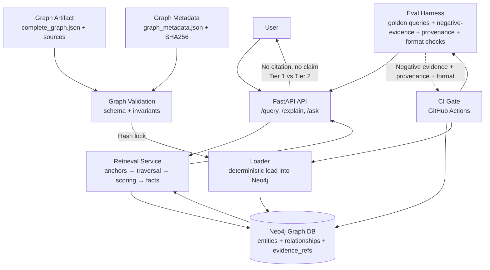

# Production-Grade GraphRAG for Kubernetes Incident Reasoning

This system provides deterministic, explainable reasoning over Kubernetes infrastructure incidents using an incident-centric knowledge graph. I built it because naive vector RAG breaks down for incident reasoning in three specific ways: ambiguous symptoms ("kubelet crash" matches many incidents with different root causes that embeddings can't tell apart), similar components with distinct failure modes (semantic similarity conflates unrelated incidents on the same component), and causal correctness (incident reasoning needs precise chains — component → failure mode → root cause — not just topical relevance). Instead of embeddings and a black-box LLM, this system answers questions like *"What causes kubelet to crash with concurrent map writes?"* by walking typed graph relationships and requiring every claim to carry a citation back to source evidence.

[](.github/workflows/eval.yml)
[](#)

<!-- VERIFY: no LICENSE file currently in the repo root — add one (MIT suggested, see META.md) and update this badge row to include it. -->

## Key features / architecture

- **Deterministic anchor extraction and traversal** — natural-language queries map to graph entities via synonym mappings and explicit pattern matching, not embeddings. Same query, same result, every run.
- **Normalized graph schema** — `incident`, `component`, `failure_mode`, `root_cause`, `trigger`, `artifact`, and `concept` node types, connected by typed edges (`AFFECTS`, `EXHIBITS`, `CAUSED_BY`, `TRIGGERED_BY`, `USES`, `INVOLVES`). Incidents are first-class query anchors, not generic entities.
- **"No citation, no claim" provenance enforcement** — every Tier-1 factual edge must carry `evidence_refs` resolving to a real source (GitHub issue, doc, or KEP). The `/ask` endpoint refuses to answer rather than emit an uncited claim, and the loader rejects ingestion of edges missing evidence.
- **Tiered answers** — causal facts (Tier 1) go in the narrative and evidence bullets; contextual concepts (Tier 2, `INVOLVES`) are reported separately and never presented as if they explained causality.
- **Dataset artifact discipline** — `complete_graph.json` is a versioned artifact locked by a SHA256 hash in `graph_metadata.json`; the loader refuses to load on a hash mismatch, and `graph/validate_graph.py` enforces schema and structural invariants (every incident has exactly one `EXHIBITS`, one `CAUSED_BY`, and at least one `AFFECTS`) before anything touches Neo4j.
- **CI-gated evaluation harness** (`eval/run_eval.py`) — golden queries with accuracy@k, negative-evidence assertions (forbidden root causes/components must never appear), provenance enforcement, and runbook-format checks. `.github/workflows/eval.yml` runs both eval sets on every PR against a Neo4j service container; any regression fails the build.



## Screenshot / Demo

<!-- VERIFY / TODO(owner): Capture two things and embed them here. (1) A terminal screenshot or asciinema clip of `curl -X POST http://localhost:8000/ask -d '{"question": "What causes kubelet to crash with concurrent map writes?"}'` showing the JSON response — specifically the `summary`, `evidence_bullets` with their `evidence_refs`, and `context_concepts` fields, since the tiering/citation behavior is the whole point of this project and is invisible from prose alone. (2) A Neo4j Browser screenshot of one incident's subgraph (the incident node plus its AFFECTS/EXHIBITS/CAUSED_BY/TRIGGERED_BY neighbors) to make the graph model concrete at a glance. -->

## How to run locally

### Quickstart (Docker)

```bash
# Ensure Docker Desktop is running

# Copy environment variables
cp .env.example .env

# Start Neo4j and API services
make up

# Load the graph into Neo4j
make load

# Run evaluations
make eval-docker
```

This starts Neo4j and the API in Docker containers, loads the graph, and runs both eval sets. The API is available at `http://localhost:8000`.

Other Makefile targets: `make down` (stop + remove volumes), `make smoke` / `make smoke-docker` (health check + test query), `make eval` (evals against a local API), `make clean` (remove all containers and volumes).

### Manual setup

Prerequisites: Python 3.11+, Neo4j 5.x (Docker or local), Neo4j credentials (default `neo4j`/`testpassword`).

```bash
# Start Neo4j
docker run -d --name neo4j -p 7474:7474 -p 7687:7687 \
  -e NEO4J_AUTH=neo4j/testpassword neo4j:5

# Load the graph (validates schema, invariants, and hash first)
cd graph_rag_api
python scripts/load_graph.py

# Run the API
uvicorn app.main:app --port 8000
```

Endpoints: `POST /query` (graph query with anchor extraction), `GET /explain/{incident_id}`, `POST /ask` (runbook-grade tiered answer), `GET /debug/stats`.

```bash
# Run evaluations
python eval/run_eval.py --gold eval/golden_queries.jsonl --k 5 --base-url http://127.0.0.1:8000
python eval/run_eval.py --gold eval/golden_queries_hard.jsonl --k 5 --base-url http://127.0.0.1:8000
```

Both should report full accuracy with zero negative-evidence, provenance, or format violations.

After modifying `complete_graph.json`, regenerate and verify the locked metadata:

```bash
python scripts/update_graph_metadata.py           # regenerate
python scripts/update_graph_metadata.py --check    # verify metadata matches computed values
```

## Design decisions & tradeoffs

*(My reasoning, in my own words, for the choices that shaped this system.)*

- **Deterministic graph traversal over embeddings, on purpose.** I chose to build zero trained models into this pipeline. The tradeoff is real: this system can't generalize to a phrasing it doesn't have a synonym mapping for, the way a vector search would. What it buys back is reproducibility (same query, same answer, every run) and debuggability (a wrong answer traces to a specific rule or a specific graph edge, not to "the embedding was close enough"). For incident postmortems, where being confidently wrong is worse than saying "I don't know," I decided that tradeoff was worth it.
- **"No citation, no claim" as a hard API-level rule, not a guideline.** The `/ask` endpoint filters out uncited Tier-1 facts and returns a refusal rather than a plausible-sounding but ungrounded answer. This is stricter than most RAG systems, which usually degrade gracefully into fluent hallucination. I'd rather the API say nothing than say something wrong.
- **Tier 1 vs Tier 2 facts as a first-class API concept**, not just an internal implementation detail — so that a contextual concept (e.g., "concurrency-control") can never masquerade as a root cause in the response. This came directly from wanting to prevent a specific failure mode I could picture happening otherwise.
- **Neo4j over a generic vector store.** The data model is inherently relational (incident → component → failure_mode → root_cause chains), so a property graph with typed relationships is a more natural fit than nearest-neighbor search over flattened embeddings. Tradeoff: onboarding a new incident requires curating it into the typed schema by hand (or via the planned Phase 2 pipeline) rather than just embedding a document and dropping it in.
- **Hash-locked dataset as a deliberate artifact-discipline choice.** Treating `complete_graph.json` like a build artifact (SHA256-locked, schema-validated, invariant-checked before load) means a silent data edit can't corrupt the graph without the loader refusing to run. This is more ceremony than most side projects bother with, but the whole system's credibility rests on the graph being trustworthy.
- **CI eval gate mirrors a real test suite, not a vibes check.** Negative-evidence assertions (a query can assert a root cause must *not* appear) are, in my view, more informative than accuracy-only evals, because they catch the specific failure mode of "right incident, wrong reasoning" that a top-1 accuracy score would miss.

<!-- VERIFY: despite the repo name, I have not run this against a live/production Kubernetes cluster or real-time incident feed — the current graph is a curated dataset of historical Kubernetes issues (see complete_graph.json), not a live ingestion pipeline. Phase 2 (Kubeflow-based ingestion) is scaffolding only, per the roadmap below. Worth clarifying "prod-graph-rag" in the repo name refers to production-grade *engineering discipline* (CI gates, hash locking, provenance), not a system currently deployed against production traffic. -->

## Status, roadmap & known limits

**Phase 1 — complete.** Deterministic GraphRAG with evaluation and CI gates: incident-centric knowledge graph, deterministic anchor extraction, provenance enforcement, fact tiering, runbook-grade formatting, comprehensive eval harness, CI regression gate, dataset artifact discipline.

**Phase 2 — planned.** Kubeflow pipeline (KFP v2) for automated graph ingestion, validation, evaluation gating, and metadata versioning. A minimal pipeline skeleton already exists in `pipelines/` (validate → update metadata → load → eval gate), but current components are placeholders — this is scaffold only and doesn't change current API behavior.

**Phase 3 — optional.** Hybrid vector + graph retrieval, with the graph remaining the authoritative grounding layer and vector similarity only expanding recall.

**Phase 4 — future.** LLM-backed narrative generation layered on top of the structured facts, with strict grounding checks and a fallback to deterministic templates if grounding fails. The deterministic core will not be replaced by this.

**Known limits today:** no trained/ML component means recall is bounded by the synonym/pattern mappings, not semantic similarity — a query phrased very differently from the mapped vocabulary may not resolve; the graph dataset is curated, not live-ingested; no LICENSE file yet (see META.md).

## License

<!-- VERIFY: no LICENSE file present in the repo. MIT is suggested in META.md — add a LICENSE file and update this section once chosen. -->
